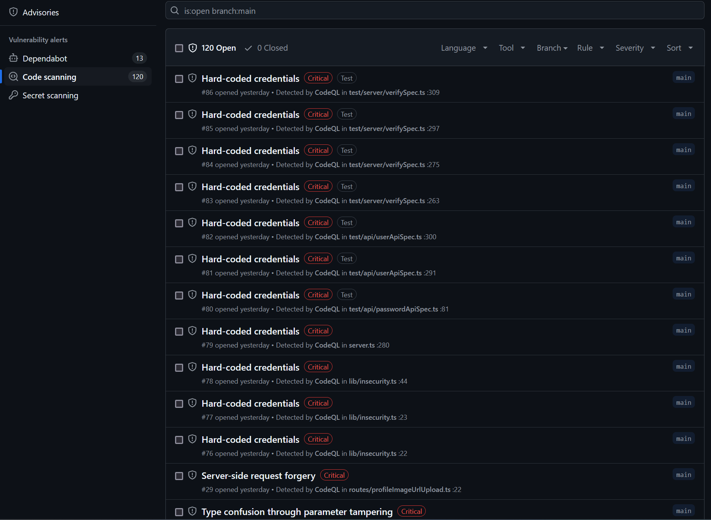
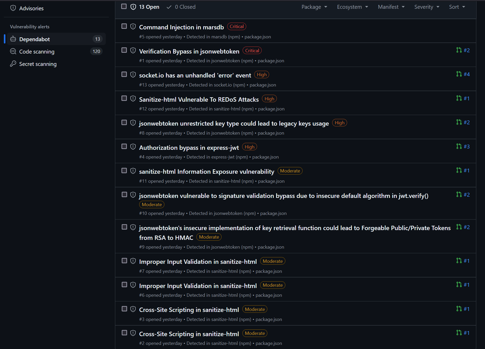
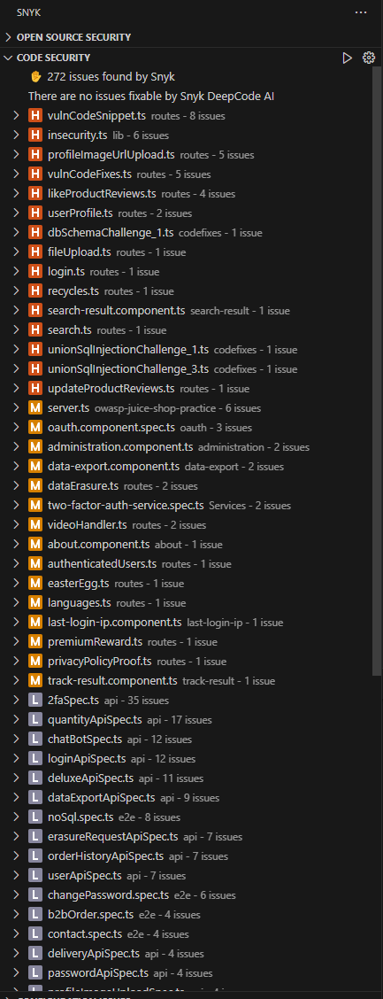
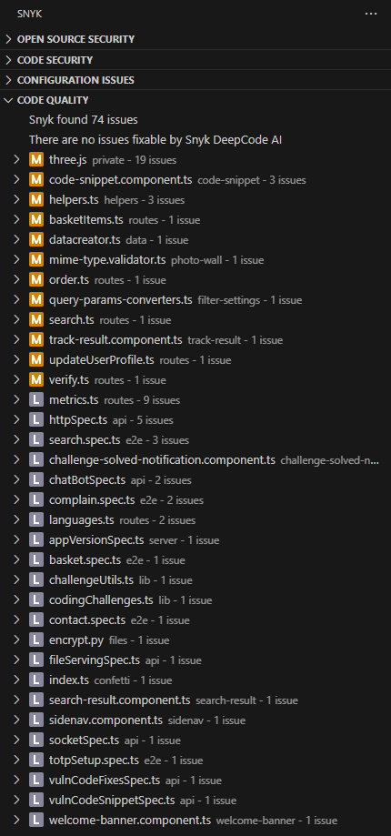

# Original Code Analysis 

### GitHub Code Scanning    
  

### GitHub Dependabot  
  

### Snyk Security scan with Visual Studio Code extension  

#### Code Security  
- 272 issues found by Snyk  
  - 39 high  
  - 27 medium  
  - 206 low  

  

#### Code Quality
- Snyk found 74 issues  

  
